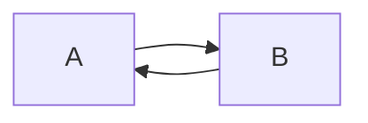

# Test-PCB

```wave
<WaveDormHeader>
  {signal: [
    {name: 'clk', wave: 'p.....|...'},
    {name: 'dat', wave: 'x.345x|=.x', data: ['head', 'body', 'tail', 'data']},
    {name: 'req', wave: '0.1..0|1.0'},
    {},
    {name: 'ack', wave: '1.....|01.'}
  ]}
</WaveDormHeader>
```




